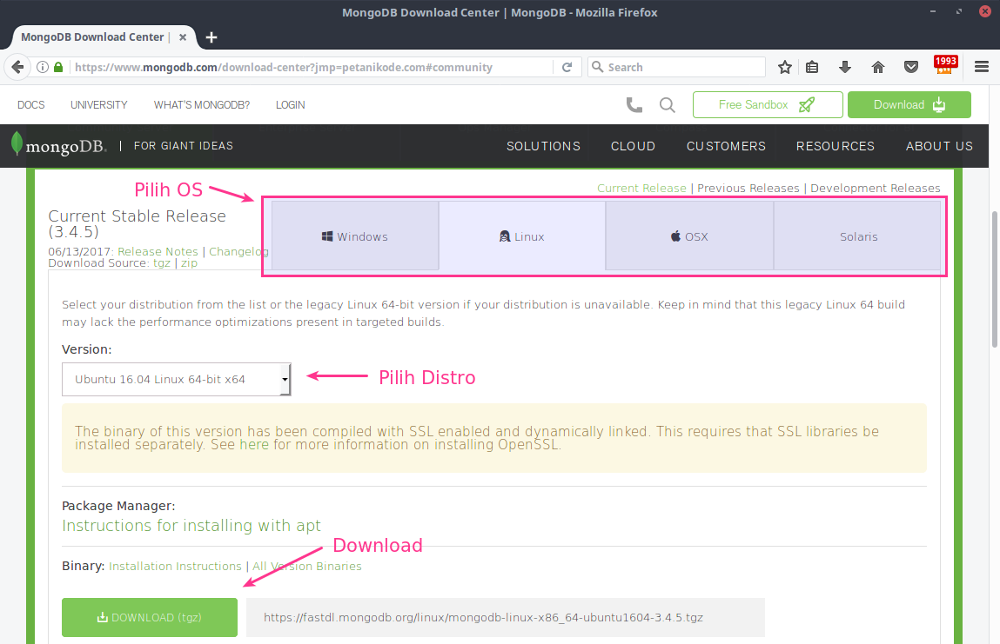

# Pengenalan Dasar MongoDB untuk Pemula

seperti saya

---

### SQL ( Structure Query Language)

- SQL adalah (Structured Query Language) adalah sebuah bahasa yang digunakan untuk mengakses data dalam basis data relasional. Saling terhubung

---

### Masalah

- _Ada beberapa kekurangan dalam database SQL yang pernah saya temukan, seperti skema database yang kaku (fixed), susah membuat query untuk tabel dengan relasi yang kompleks, susah diperbesar sekalanya, dsb._

---

### Solusi NoSQL

- _Database NoSQL_ (Not Only SQL) bukan database yang terstruktur hadir untuk menutupi kekurangan-kekurangan tersebut. Selain itu, NoSQL sudah menjadi tuntutan teknologi yang harus dipelajari dalam pengembangan software modern masa kini.

---

### Apa itu MongoDB?

_MongoDB_ adalah salah satu jenis database NoSQL yang berbasis dokumen dengan fomat _JSON_.

Pada database SQL, data disimpan dalam bentuk tabel. Sedangkan pada MongoDB data disimpan dalam bentuk dokumen dengan format JSON.

---

@title[Contoh Skrip Mongo DB]

<p><span class="slide-title">JavaScript Block</span></p>

```javascript
{
   "_id" : ObjectId("54c955492b7c8eb21818bd09"),
   "alamat" : {
      "street" : "2 Avenue",
      "zipcode" : "10075",
      "building" : "1480",
      "coord" : [ -73.9557413, 40.7720266 ]
   },
   "borough" : "Manhattan",
   "cuisine" : "Italian",
   "grades" : [
      {
         "date" : ISODate("2014-10-01T00:00:00Z"),
         "grade" : "A",
         "score" : 11
      },
      {
         "date" : ISODate("2014-01-16T00:00:00Z"),
         "grade" : "B",
         "score" : 17
      }
   ],
   "name" : "Vella",
   "restaurant_id" : "41704620"
}
```

---

### Instalasi MongoDB di Linux

Jika kita ingin menggunakan MongoDB versi terbaru, maka kita harus men-download versi terakhir di website reseminya di [mongodb.com](https://www.mongodb.com/download-center).

---

### Portal Download MongoDB



---

Tapi, jika ingin menggunakan versi lama yang ada di repositori, kita bisa menginstalnya dengan perintah:

`sudo apt install mongodb`

---

Setelah itu, untuk memastikan sudah terinstal dengan benar, coba ketik perintah `mongo --version` atau `mongod --version` untuk memeriksa versinya.

---

Untuk keperluan belajar dasar, kita bisa pakai yang mana saja. Versi lama atau versi beru tidak masalah.

Pada panduan ini, saya menggunakan versi yang lama.

---

### Cara Mengoperasikan MongoDB

Ada beberapa perintah yang disediakan MongoDB untuk mengoperasikannya, seperti perintah `mongod` (_MongoDB Daemon_) untuk membuat server dan `mongo` untuk masuk ke Shell MongoDB.

---

###Menghidupkan dan Mematikan Server MongoDB

Kita bisa menghidupkan dan mematikan server MongoDB dengan perintah `service` di Ubuntu dan keluarga Debian lainnya.

---

Menyalakan server MongoDB:

`sudo service mongodb start`

Mematikan server MongoDB:

`sudo service mongodb stop`

---

Menyalakan ulang server MongoDB:

`sudo service mongodb restart`

Melihat status server MongoDB:

`sudo service mongodb status`

Gunakan tombol keyboard `q` untuk keluar dari status.
